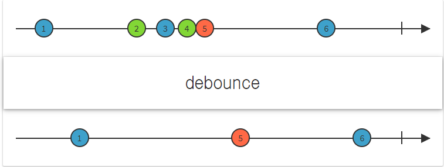

# RxJava 2주차

유추 : create 는 onNext 일때 onNext 호출  onComplete일때 onComplete 호출할수 있도록 해준다

설명: create는 가장 기본적인 연산자로 Observable 생성하여 observer method를 호출

유추: defer는 하나의 아이템 발행이 진행하고 나서 끝나면 observable을 끝내지 않고 다른 아이템을 발행 하여 진행하게 한다 .

설명: observer가 구독하기 전까지는 observable을 생성하지 않고 각 observer에 대해 새로운 observable을 생성한다

유추 : from은 묶여 있는 아이템을 분해시켜 발행한다(?)

설명 : 다양한 객체를 Observable로 변환한다.

유추 : interval은 아이템을 interval 시간 만큼 지연시킨후 발행 한다.

설명: 지정한 일정한 간격으로 정수값을 출력하는 Observable을 생성

유추: just는 아이템을 발행하면 그 데이터를 바로 발행한다

설명: 직접 인수로 전달된 객체로 Observable을 생성합니다.

유추: repeat는 아이템을 발행하면 그 데이터를 계속 반복적으로 발행한다.

설명: 특정 항목을 여러 번 방출하는 Observable 생성

유추: debounce는 아이템을 일정시간뒤 제일 마지막 아이템을 발행

설명  : 특정 시간 범위가 다른 항목을 내보내지 않고 경과한 경우에만 Observable에서 항목을 내보낸다

유추 : Replay는 아이템들을 발행하면서 어느 요청 시점에 다시 아이템들을 발행한다

설명: Observable이 항목을 방출하기 시작한 후에 구독하더라도 모든 관찰자가 방출된 항목의 동일한 시퀀스를 볼 수 있도록 합니다.